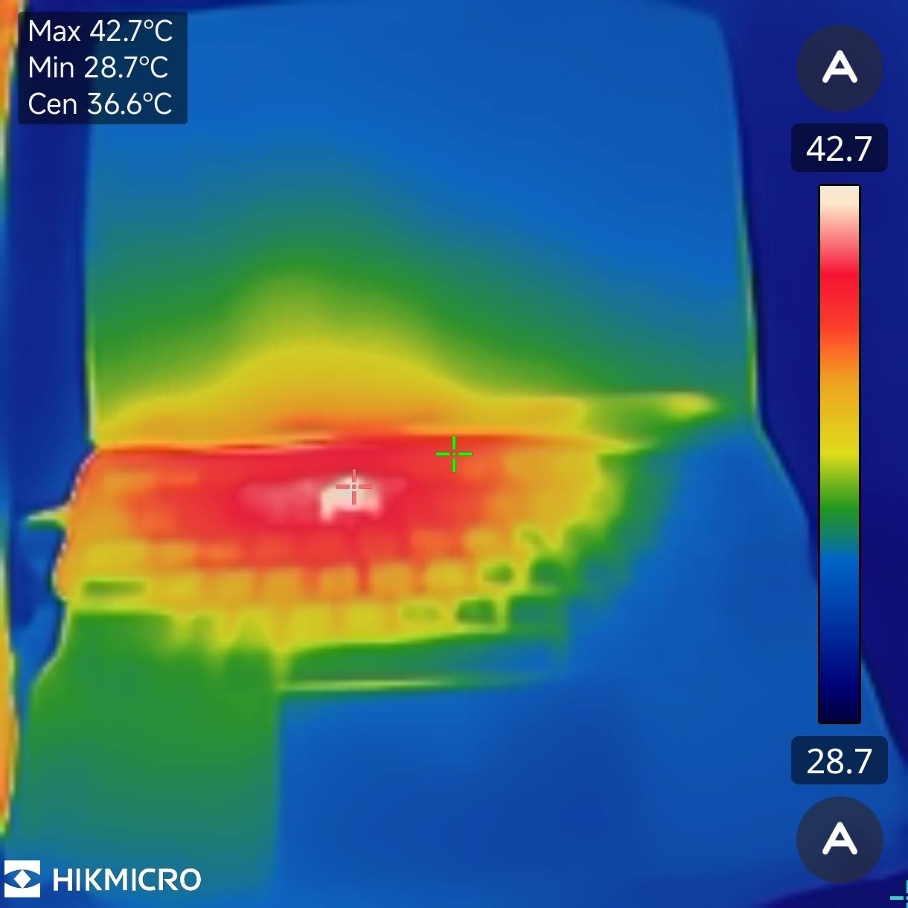
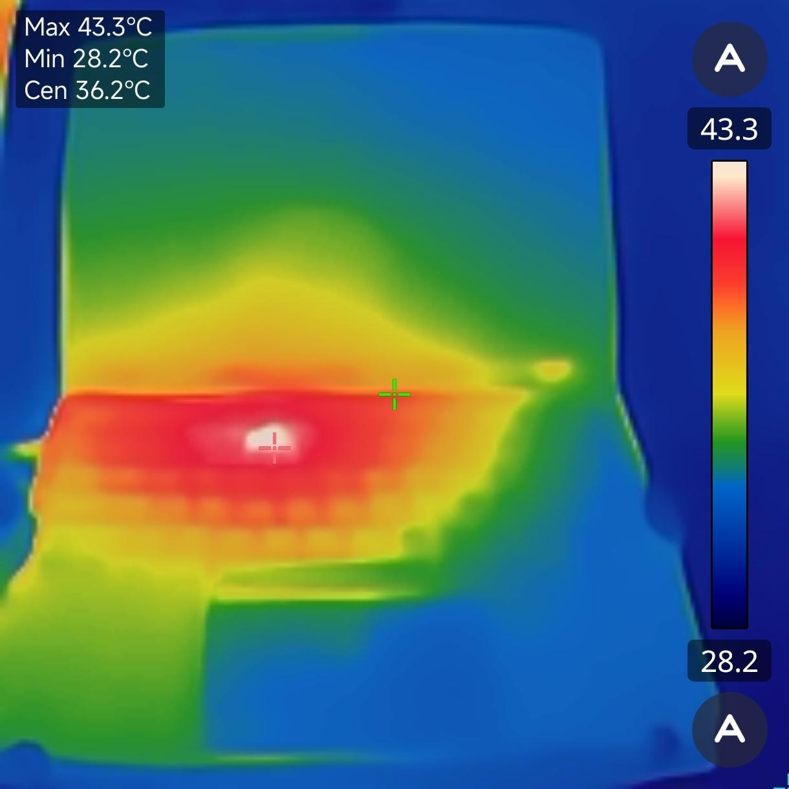
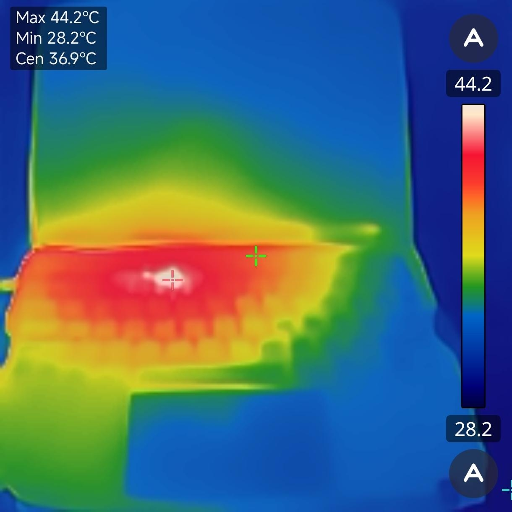
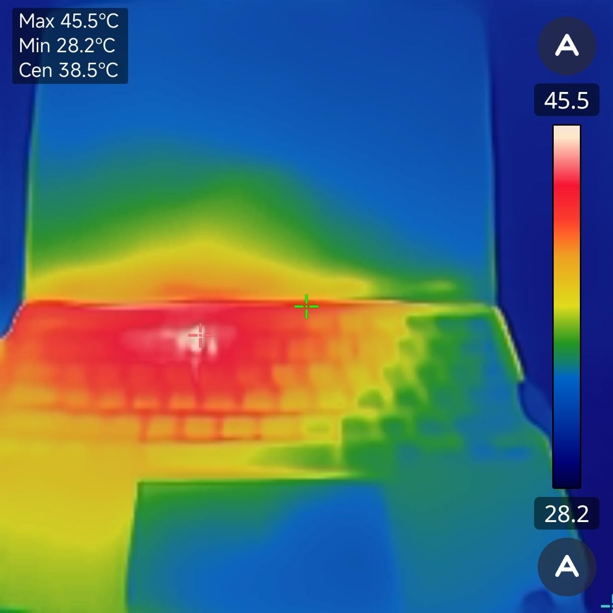

<div align="center">


# Warm Kitty

**Turn your MacBook into a hand warmer.** One tap, a sleepy ginger cat, and your
laptop's own waste heat does the rest.

[](https://github.com/BarryBarrywu/warm-kitty/releases/latest)
&nbsp;
[](https://warmkitty.barrybarrywu.com)
&nbsp;

&nbsp;


</div>

Cold hands at the desk in winter? Your Mac already has a high-end space heater
bolted to it — the SoC. Warm Kitty just turns it on, on purpose. Pick a timer,
hit start, and the keyboard deck warms up under your palms while a cat naps on
screen. When the countdown ends, everything stops on its own.

It's a joke that actually works. The thermal images below are real.

---

## Real-world results

Measured with a HIKMICRO thermal camera, ambient ~28 °C, pointed at the keyboard
deck and palm-rest — the part your hands actually touch. Full load, CPU + GPU.

| Boot (cold) | 5 min | 10 min | 15 min |
|:---:|:---:|:---:|:---:|
|  |  |  |  |
| **Max 42.7 °C** | **43.3 °C** | **44.2 °C** | **45.5 °C** |
| center 36.6 °C | 36.2 °C | 36.9 °C | 38.5 °C |

The deck climbs steadily and holds in the low-to-mid 40s °C — warm to the touch,
not hot. That's the honest ceiling on this machine (see [Limits](#limits)).

---

## How it works

Warm Kitty is a tiny native macOS app: a Swift shell hosting a WKWebView UI, with
two heat engines underneath. There is **no thermal sensing** — you pick how long,
your hands judge the warmth, and the countdown is the auto-stop.

**CPU — `Sources/HeatingEngine.swift`**
One busy thread per logical core, each running back-to-back dense
512×512 single-precision matrix multiplies (`cblas_sgemm` from Accelerate). Dense
GEMM saturates the vector units — Apple Silicon's AMX / Intel's AVX — which draw
far more power (and dump far more heat) than a scalar busy-loop at the *same*
reported CPU%. It's the same trick Linpack-style stress tests use to push a chip
to its thermal max. The 512×512 working set is deliberately cache-resident, so the
threads burn FLOPs rather than stalling on memory bandwidth.

**GPU — `Sources/GPUHeatingEngine.swift`**
A second, independent heat source. A Metal compute kernel runs a tight FMA loop
with a data dependency the optimizer can't eliminate, and a background thread keeps
submitting command buffers back-to-back to hold the GPU busy. No-op on machines
without a Metal device.

**Session — `Sources/SessionController.swift`**
You choose a 1–15 minute countdown. Start fires both engines at full tilt; the
per-second timer is the only thing that stops them. Hitting zero, pressing stop, or
quitting the app tears both engines down. That's the whole control loop.

The bridge (`Sources/Bridge.swift`) is a thin `WKScriptMessageHandler` that forwards
start/stop/window actions from the page and pushes tick / running / done events back
into the UI.

---

## How it improves on the original idea

The seed is [z3ugma's 2019 post](https://z3ugma.github.io/2019/11/18/warm-up-your-macbook/),
which warmed a cold MacBook by pegging the CPU with `yes > /dev/null` or
`stress -c 6 -m 2 -t 300`. Brilliant and crude. Warm Kitty keeps the idea and fixes
the rough edges:

| | `yes` / `stress` | Warm Kitty |
|---|---|---|
| **Heat per watt** | scalar CPU loop (+ RAM) | dense GEMM on the vector units **+** a Metal GPU kernel — more watts, more heat, faster, concentrated under your palms |
| **Heat sources** | CPU only | CPU **and** GPU in parallel |
| **Stopping** | `yes` runs forever ("don't forget about it"); `stress -t` has a fixed timeout | user-chosen 1–15 min countdown, auto-stop, one-tap manual stop, stops on quit |
| **Form** | a terminal command + a shell alias | a one-tap native app with an animated cat, multiple languages, and settings |
| **Honesty** | no data | real thermal-camera numbers, and a frank note on what low-power fanless chips can't do |

---

## Features

- One tap to start, a clear timer, and a hard auto-stop.
- Dual CPU + GPU heating for the fastest ramp the machine allows.
- Calm, hand-drawn ginger-cat animation that wakes, stretches, and dozes through the session.
- A completion chime when the timer ends.
- Localized in English, 简体中文, 繁體中文, and 日本語.
- Pure Apple frameworks — Accelerate, Metal, WebKit, AppKit. No third-party runtime dependencies in the app.

## Use cases

- Warming your hands at a cold desk before you can actually type.
- Taking the chill off a freezing-cold laptop before a winter commute.
- A genuinely useful party trick for "what does this app do?"
- A compact, readable reference for how to max out CPU (Accelerate/GEMM) and GPU
  (Metal compute) load in Swift.

---

## Install

Get it from [**warmkitty.barrybarrywu.com**](https://warmkitty.barrybarrywu.com), or
download the latest `.dmg` straight from the
[**Releases**](https://github.com/BarryBarrywu/warm-kitty/releases/latest) page,
open it, and drag **Warm Kitty** into Applications. macOS 13+.

The app isn't notarized yet, so on first launch use **right-click → Open** (or allow
it under *System Settings → Privacy & Security*).

## Build from source

The Xcode project is generated from `project.yml` with
[XcodeGen](https://github.com/yonaskolb/XcodeGen):

```sh
brew install xcodegen
git clone https://github.com/BarryBarrywu/warm-kitty.git
cd warm-kitty
xcodegen generate
open WarmKitty.xcodeproj   # then build & run, or:
xcodebuild -scheme WarmKitty -configuration Release build
```

---

## Limits

Be honest about the physics: software can't push a chip past its own heat output.

Warm Kitty runs the SoC at full load, but how warm the case actually gets is set by
how many watts the machine can turn into heat and how it spreads them. Fanless,
low-power designs (MacBook Air, and especially phone-class chips) can report a high
internal die temperature while only ever feeling *warm* at the deck — there simply
aren't enough watts reaching the surface. Machines with active cooling and a higher
power budget warm up more, and faster.

So: warm hands, yes. A scalding hotplate, no. The numbers above are what one real
machine reached — yours will differ.

---

## License

[MIT](LICENSE) © 2026 BarryBarrywu

If Warm Kitty kept your hands warm, you can [sponsor the project](https://sponsor.barrybarrywu.com).
